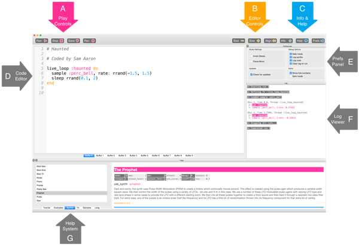

## First sounds with Sonic Pi



This is the Sonic Pi interface; it has three main windows. The largest one is for writing your code, and we call it the Programming Panel. There is also an output panel that displays information about your program as it runs. When you click on the **help** button at the top of the window, the third panel appears along the bottom displaying help documentation. This contains information about different code you can try and use, as well as different synth sounds, samples, and much more.

- Launch Sonic Pi from the desktop or applications menu.

- Select **Buffer 1** and type:

	```ruby
	play 60
	```
	
- Click on the **play** icon at the top of the screen. What happens?

- What happens if you type `pley 60` and click on the play icon?

	This is an example of a bug in your code. In later activities, if the error panel displays text you will know that you have a bug that you need to fix. It could be that you have misspelt a word like `play`.

- Now type:

	```ruby
	play 60
	play 67
	play 69
	```
	
- Click on the play icon at the top of the screen. What happens?

- The computer is playing each note in sequence (one after the other), but it is happening so fast that to us they sound like they are playing at the same time.

	We need to tell the computer to pause between each note. We can do this by typing the following after each `play`:

	```ruby
	sleep 1
	```
	The value entered after the word `sleep` represents time in seconds. Using the value 1 represents one second. What would you type for half a second?

- Now write a sequence of play and sleep to make a cool-sounding tune!

